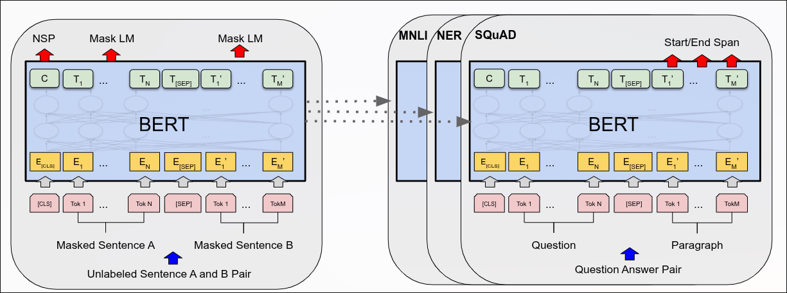
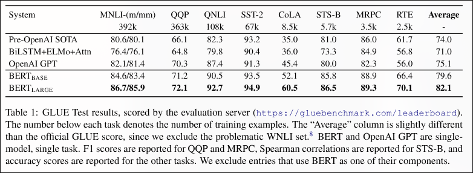
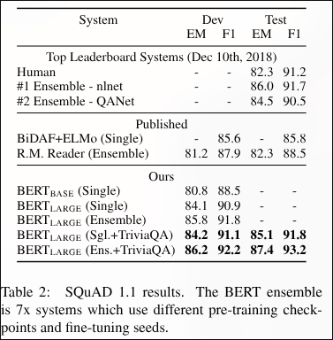
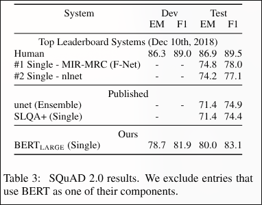
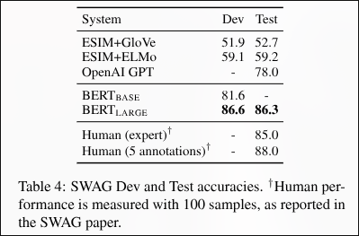

# BERT: Pre-training of Deep Bidirectional Transformers for Language Understanding

**Authors:** Jacob Devlin, Ming-Wei Chang, Kenton Lee, and Kristina Toutanova
**Year:** 2018
**Arxiv / Link:** https://arxiv.org/abs/1810.04805
**Area:** LLMs

---

## Problem
There are two main problems that this paper tried to address. 
- This paper wanted to solve some limitations between training and fine-tuning of a model. Fine tuning state of the art models at that time was done through one of the following two ways. The first way was to use and freeze a feature-based model to get the word encodings and feed it to a task-specific custom architecture with fine-tuning to these new layers. The second approach was to use the unidirectional trained model with minimal task-specific changes but with the need for fine-tuning for the whole architecture.
- Until that day, there were no true bidirectional models. All models construct understanding of the sentence using one-way look (left to right or right to left), so it was hard when understanding a certain token to have a proper understanding of the whole context. The closest model to solve this problem was ELMo. It consists of two separate models; each one has its own direction, and the hidden states of both models are concatenated.

---

## Contributions
- Constructed a bidirectional model that can build better contextual understanding for tokens.
- Demonstrated a unified fine-tuning framework that adapts to many NLP tasks with minimal architectural changes.
- Established a new state-of-the-art across multiple NLP benchmarks.

---

## Proposed Solution
The authors proposed a new language model that can be used with minimal modifications to work on different downstream tasks. They introduced BERT (Bidirection Encoder Representation from Transformers). 

### Architecture
BERT's model architecture is a multi-layer bidirectional transformer encoder. It consists of position and segment encoding added to WordPiece embeddings. After that come different multi-attention heads with a softmax activation function. 
### Input Representations
- The [CLS] token is passed at the start of every sequence. This token builds a full understanding of the complete sequence, which enables its output embeddings to be used in different downstream classification tasks.
- The [SEP] token is used to separate sentence pairs in one sequence. 
### Pre-training
The significant change in this model training is that it doesn't depend on left-to-right or right-to-left language model training. Instead, BERT was pretrained using the following two unsupervised tasks.
- **Masked LM (MLM)** 
During the training process, some words following a certain percentage are masked. This gives the model the chance to see the full sequence by attending to all tokens to predict the masked words.
Sometimes these masked words are replaced with random words or kept unchanged to make the model face the reality that there will be no masked words in test samples.
- **Next Sentence Prediction (NSP)** 
This task tries to train the model on catching the relation between different sentences for some downstream tasks like question answering (QA) and natural language inference (NLI).
For each pre-training examples sequence consists of two sentences (A and B). 50% of the time, B is the actual next sentence that follows A, and 50% of the time, B is just a random sentence.
### Fine-tuning
For each task, this can be done by plugging in the task-specific inputs and outputs into BERT and fine-tuning all the parameters end-to-end.

---

## Experimental Results
BERT was fine-tuned and tested on 11 different NLP tasks. BERT model outperformed all other models and architectures, proving a huge improvement. BERT even outperformed the OpenAI GPT model, which consists of a similar architecture but lacks bidirectional learning. Results of different tasks can be seen in the following images.    

---

## Strengths
- Proposed a unified system for pre-training and fine-tuning that works across many NLP tasks without the need for architectural changes.
- Introduced Masked Language Modeling (MLM), enabling true deep bidirectional language representations.
- The system was built on the transformer's encoder, exploiting the ability to parallelize operations.
- Achieved state-of-the-art performance on numerous sentence-level and token-level benchmarks.

---

## Weaknesses / Limitations
- The [MASK] token introduces a mismatch between pre-training and fine-tuning. Although the authors addressed this problem using random word replacement, finding a better solution can enhance performance.
- Next Sentence Predictions (NSP) seem to be a weak training signal.
- Computational complexity for very long sequences can be exhaustive because of the O(n^2 . d) complexity of the attention heads.

---

## Reproducibility
This paper results is highly reproducible. Model architecture, training parameters, and datasets are clearly explained and versioned.
