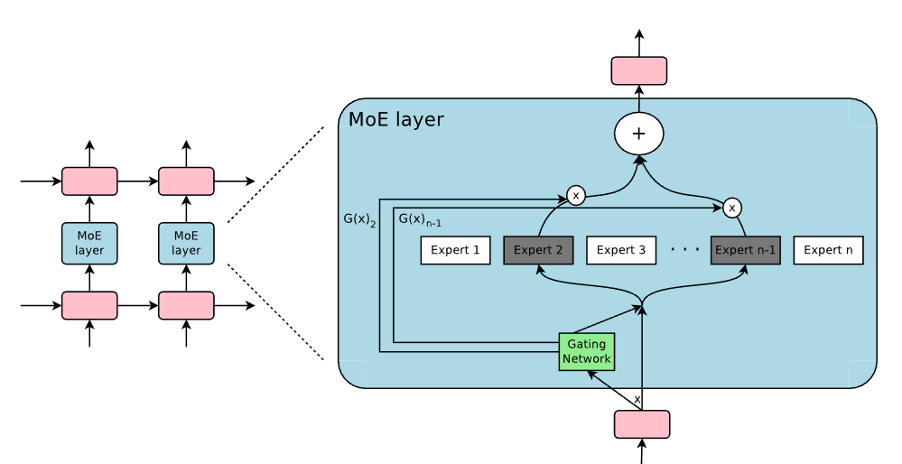
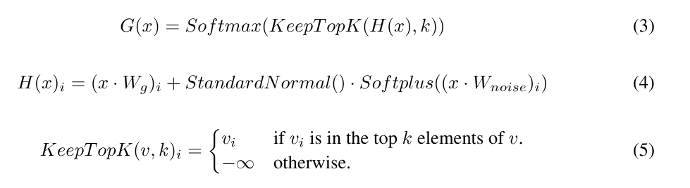
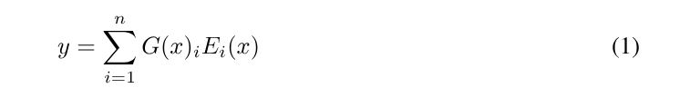

# OUTRAGEOUSLY LARGE NEURAL NETWORKS : THE SPARSELY-GATED MIXTURE-OF-EXPERTS LAYER

**Authors:** Noam Shazeer, Azalia Mirhoseini, Krzysztof Maziarz, Andy Davis, Quoc Le, Geoffrey Hinton, and Jeff Dean
**Year:** 2017
**Arxiv / Link:** https://arxiv.org/abs/1701.06538
**Area:** LLMs

---

## Problem
The data is increasing and there is a demand to increase the model capacity to absorb more information. The problem is to find a way to increase the model capacity (parameters) with the increase of data and gain improvements in prediction with less than quadratic blow-up in training costs.

---

## Challenges
The challenges that need to be addressed to design a conditional computation solution:
-  Modern computing devices, especially GPUs, are much faster at arithmetic than at branching.
- Large batch sizes are critical for performance, as they amortize the costs of parameter transfers and updates. Conditional computation reduces the batch sizes for the conditionally active chunks of the network.
- Network bandwidth can be a bottleneck.
- Depending on the scheme, loss terms may be necessary to achieve the desired level of sparsity per-chunk and/or per example.

---

## Proposed Solution
They introduced a conditional computational network to the architecture called sparsely-gated-mixture-of-experts layer (MoE).
The network consists of a number of experts, each a simple feed-forward neural network, and a trainable gating network which selects a sparse combination of the experts to process each input. 
- The gating computations isn't just a softmax for the product of the inputs with the trainable weight matrix because this can cause problems like: 
    1- The possibility of over using some experts and ignoring others.
    2- Activating a lot of experts because there is no loss on the sparsity of the number of experts. 
- The output of the MoE module is the summation of the product of the gating network and the output of the i-th expert.  

---

## Contributions
- Tried to apply conditional computation to increase the model capacity and performance efficiently to avoid the proportional increase in the computational cost,  achieving more than a 1000× increase in model capacity with only minor losses in computational efficiency.
-  Developed practical solutions to solve problems in conditional computational approaches, including:
    - **A noisy top-k gating loss function with load balancing loss:** to obtain sparse routing while maintaining uniform load balancing.
    - **A combination of data and model parallelism:** so that communication between GPUs is so small relative to the computations required.

---

## Experimental Results
The authors evaluated the sparsely-gated MoE layer mainly on **language modeling** and **machine translation** tasks. The experiments were designed to test whether increasing model capacity through many sparsely activated experts can improve model quality without a proportional increase in computation.

### 1. 1 Billion Word Language Language Modelling Benchmark
- The authors tested different MoE models with the previous-state-of-the-art LSTM model. 

### 2. 100 Billion Word Google News Corpus
- The authors tested the performance of LSTM model paired with MoE module with different number of experts and parameters. The test results were staged after training on 10B words once and another time after training on 100B words.  

### 3. Machine Translation (Single Language Pair)
- The authors used a modified version of The GNMT model with different variations. 
The introduced models achieved a 1.34 and 1.12 BLEU score gain on top of the score of the strong baseline due to the significant increase in the number of parameters.

### 4. Multilingual Machine Translation
- The authors used on MoE model and compared it to baseline model in 12 language pairs combined datasets. 

### Overall Result
The experiments demonstrated that sparsely-gated MoE layers can provide a large increase in model capacity with only a relatively small increase in computation, which support the paper's central hypothesis.

---

## Strengths
- The results showed that model capacity can be increased by more than 1000× while keeping computation relatively small.
- The authors found a way to do effective conditional computing with minimal communication between GPUs.
- The paper introduced loss function to solve sparsity and irregularities in load balancing.

---

## Weaknesses / Limitations
- This solution the paper offers needs massive global batch sizes to ensure that each individual expert receives enough tokens for training.
- Although the authors observe that experts specialize according to syntax and semantics, the paper does not provide a complete explanation of how or why these specializations emerge.
- In a highly heterogeneous dataset the significant increase in the number of parameters caused performance degradation.

---

## Reproducibility
This paper results is highly reproducible. Model architecture, training parameters, and datasets are clearly explained and versioned.
