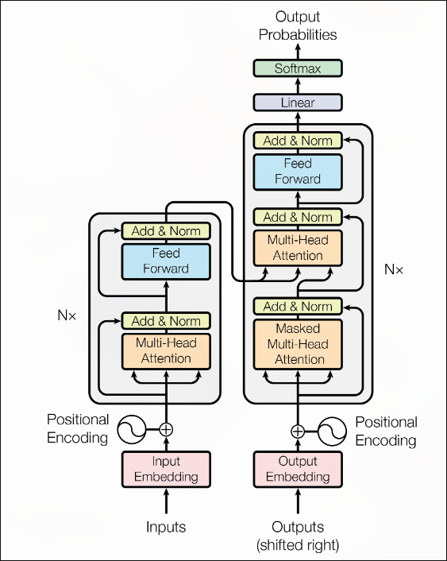
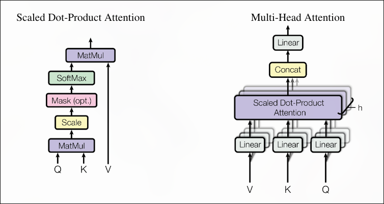
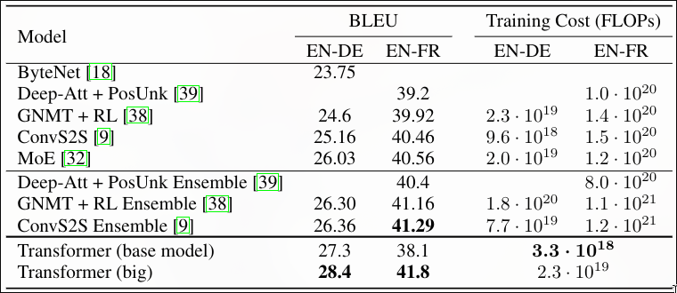

# Attention Is All You Need

**Authors:** Ashish Vaswani, Noam Shazeer, Niki Parmar, Jakob Uszkoreit, Llion Jones, Aidan N. Gomez, and Łukasz Kaiser 
**Year:** 2017
**Arxiv / Link:** https://arxiv.org/abs/1706.03762
**Area:** LLMs

---

## Problem
There are two deficiencies in recurrent neural networks that the authors wanted to mitigate. 
- The first deficiency is that many computations are sequential, which makes it harder to parallelize the training process. 
- The second deficiency is that the number of operations required to relate signals from two arbitrary positions grows linearly for many models and logarithmically for optimized models. This makes learning dependencies between distant words hard.   

---

## Contributions
- The authors proposed a novel deep learning model architecture.
- They achieved state-of-the-art translation performance with a model trained much faster than neural and recurrent models.

---

## Proposed Solution

### Architecture
This paper introduces a new network architecture called transformers. A novel network architecture for sequence transduction tasks that relies entirely on something called *attention*. The architecture, in summary, follows an encoder-decoder approach, with multi-head self-attention applied in both the encoder and decoder. 
### Multi Head Self Attention
Multi-head self-attention is a process in which each token (word) generates a query (what information I am searching for in other tokens), a key (what information I contain), and a value (the actual relevant information to be passed). 
### Positional Encodings
Transformers remove recurrence and convolution so they need something to sense the relative positions of tokens. The authors generated positional encoded embeddings and added them to the embeddings of each token to interpret the position of the token with its embeddings. 

---

## Experimental Results
That transformer was tested on two translation tasks and was compared with the finest-trained models on these tasks. It was obvious that the transformer outperformed all models in the BLEU score. One strong point of the transformer is also the huge decrease in its training cost compared to other deep learning architectures. 

---

## Strengths
This new model has a lot of strong points:
- It has much lower training costs.
- Each token has separate computation, which makes a lot of operations parallelized causing a significant drop in the training time.
- The model outscored all previous models in translation tasks, becoming the state-of-the-art model at that time.

---

## Weaknesses / Limitations
- The paper focuses mainly on machine translation tasks. Generalization to other sequence modeling tasks cannot be proven yet.
- Computational complexity for very long sequences can be exhaustive because of the O(n^2 . d) complexity this architecture has. They tried to propose a solution with a more restricted model, but its performance wasn't investigated.
- Attention alone has no interpretation for positional information, so a positional encoding is necessary. They tried learnable positional encodings and functional positional encodings. Learnable positional encodings showed better performance, but this can be done because the learnable parameters increased, and it has nothing to do with the positional information. The model should be tested on a dataset built to evaluate the interpretation of the data according to the positional information. 

---

## Reproducibility
This paper results is highly reproducible. Model architecture, training parameters, and datasets are clearly explained and versioned.

